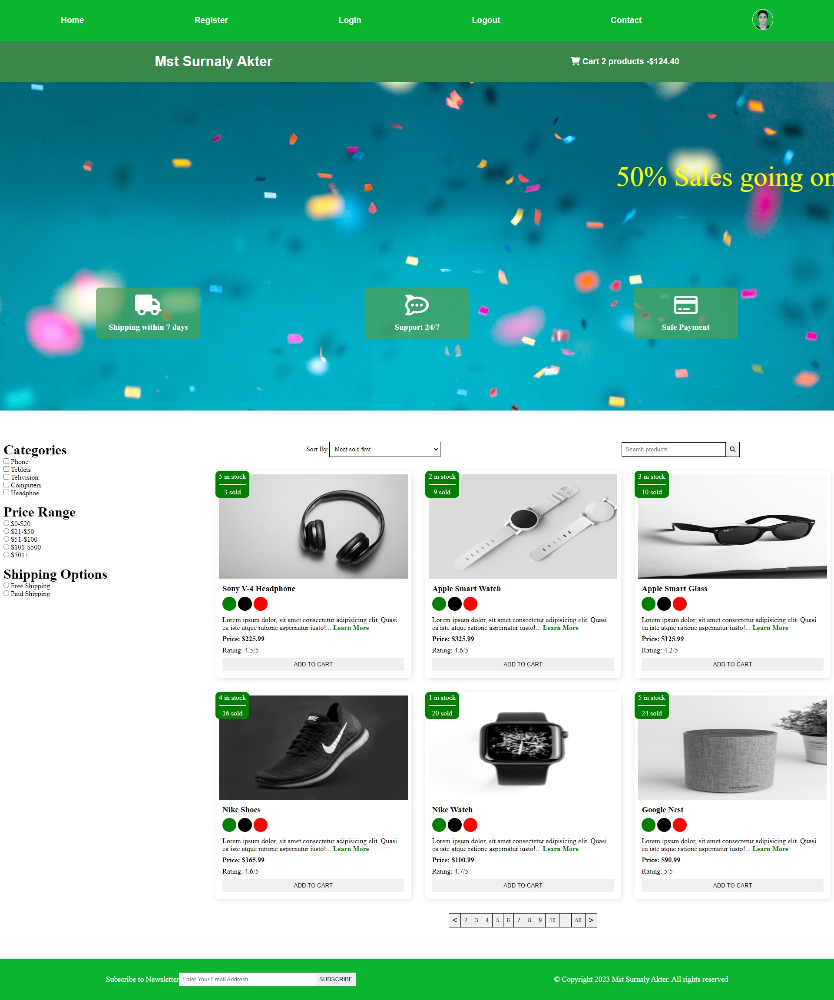

1. what & why README.md?
2. How to make a comment
3. Normal text & new line
4. Horizontal rule
5. Headings
6. Paragraph
7. italic[_]
8. bold[__]
9. strikethrough[~~]
10. inline code block[``]
11. Multiple line code block
12. List
13. Link
14. Image
15. Emoji
16. Table

## <--------------------------------------------------------------------------------------------->

<!--  -->
My name is Mst Surnaly Akter <br/>
I am a web developer

---

# Mst Surnaly Akter
## I am a web developer
### I am font-end developer

<p>This is a mst surnaly akter. I am 21 year.</p>

<i>This is a mst surnaly akter. I am 21 year.</i>

_This is a mst surnaly akter. I am 21 year_

<b>This is a mst surnaly akter. I am 21 year</b>

__This is a mst surnaly akter. I am 21 year__

<del>This is a mst surnaly akter. I am 21 year</del>

~~This is a mst surnaly akter. I am 21 year~~

`Mst Surnaly Akter`

<br/>

`<h1>Mst Surnaly Akter</h1>`

<br/>

```html
   <html>
   <head></head>
   <body>
   <h1>Mst Surnaly Akter</h1>
   </body>
   </html>
```
<br/>

```javascript
   console.log('hello');

```
<br/>

## order list
<ol>
   <li>Table</li>
   <li>List</li>
</ol>

<br/>

1. Table
      1. hello
      2. hello
2. List

<br/>

<ul>
   <li>Table</li>
   <li>List</li>
</ul>

<br/>

## Unordered List

- Table

    - Table1
    - Table2

- List

<br/>

## Task List
- [x] Task1
- [x] Task2
- [x] Task3

<br/>

## Automatic Link
https://github.com/mstsurnalyakter

## Disable Link
`https://github.com/mstsurnalyakter`


## Markdown link syntax
[GitHub](https://github.com/mstsurnalyakter)<br>
[Linkedin][Linkedin]<br>
[Facebook][Facebook]<br/>


## Image Syntax



<br/>


<br/>

## emoji

😊

<br/>

## table syntax
| Name             |      Email          |
| ---------------  | ------------------- |
|Mst Surnaly Akter | surnalyms@gmail.com |
|Mst Surnaly Akter | surnalyms@gmail.com |
|Mst Surnaly Akter | surnalyms@gmail.com |
|                  |                     |
| Name             |      Email          |
| ---------------  | ------------------- |
|Mst Surnaly Akter | surnalyms@gmail.com |
|Mst Surnaly Akter | surnalyms@gmail.com |
|Mst Surnaly Akter | surnalyms@gmail.com |
|                  |                     |

<br/>

<!-- all link here -->

[Linkedin]:https://www.linkedin.com/in/mst-surnaly-akter/
[Facebook]:https://web.facebook.com/mstsurnalyakter


## <---------------------------------------------------------------------------------->
# git state
   1. working directory/workspace(git init)
            |
    git status   git add .
            |
            @
   2. staging area/index
            | git log --oneline
   git log   git commit -m "message" git reset --soft HEAD^
   git diff |
            @
   3. local repository
   4. remote repository

## <---------------------------------------------------------------------------------->

## working directory @--- git reset HEAD^ --- local repository
## staging area @--- git reset -soft HEAD^ --- local repository
## outside @--- git reset --hard HEAD^ --- local repository
## Deleting number of commits
   - git reset -soft HEAD~2
   - git reset -soft HEAD~3
# git checkout commit_id/HEAD~Number(save using)

## git show commit_id/ git show/ git show HEAD~Number
## git revert
## git clean
## git rm
## git checkout master(remove previous position)

## <---------------------------------------------------------------------------------->

 ##  .gitignore -----> text.txt
                        .env
                        *.txt
                        !main.txt
                        test?.txt[test1.txt, test2.txt(?=1,2,3...)]
                        temp/
## <------------------------------------- Markdown -------------------------------------------->